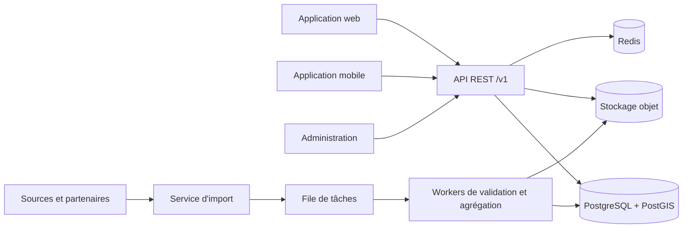

# OjoZone - Spécifications fonctionnelles et techniques

> Statut : version initiale de cadrage (MVP)  
> Dernière mise à jour : 22 septembre 2026

## 1. Vision

OjoZone permet de comparer le coût de la vie dans les pays et les villes de la zone euro à partir de données publiques, de partenaires et de contributions citoyennes.

Le service couvre quatre familles d'indicateurs :

- produits de première nécessité ;
- carburants ;
- immobilier à la location et à l'achat ;
- salaires moyens et médians.

OjoZone se compose :

- d'un site web public de consultation et de comparaison ;
- d'une application mobile iOS/Android pour consulter et contribuer ;
- d'une API commune au web, au mobile et aux imports de données ;
- d'un espace d'administration pour modérer et contrôler la qualité des données.

## 2. Principes produit

- **Comparable** : afficher l'unité, la quantité, la date, la source et la zone géographique de chaque valeur.
- **Transparent** : distinguer clairement données officielles, partenaires et contributions citoyennes.
- **Historisé** : conserver les observations afin de montrer les tendances et pas seulement le dernier prix.
- **Local** : permettre une comparaison au niveau pays, région, ville et point de vente selon la donnée.
- **Fiable** : calculer un score de confiance et modérer les valeurs suspectes.
- **Respectueux de la vie privée** : ne jamais exposer la position exacte ni les données personnelles d'un contributeur.

## 3. Utilisateurs et rôles

| Rôle | Capacités principales |
|---|---|
| Visiteur | Rechercher, comparer, consulter les tendances et la méthodologie |
| Membre | Contribuer, joindre une preuve, corriger ses contributions, suivre leur statut |
| Modérateur | Valider, rejeter, fusionner et signaler les observations |
| Administrateur | Gérer référentiels, sources, comptes, règles de qualité et imports |
| Partenaire | Alimenter des données par lot avec une clé d'API limitée |

## 4. Périmètre fonctionnel

### 4.1 MVP

1. Recherche d'un produit, d'un carburant ou d'une ville.
2. Comparaison entre deux à cinq villes ou pays.
3. Affichage du dernier prix validé, de la médiane, de l'échantillon et de la date de fraîcheur.
4. Historique mensuel des prix.
5. Contribution mobile d'un prix avec lieu, date et photo facultative du ticket ou de l'étiquette.
6. Consultation des loyers, prix immobiliers et salaires agrégés.
7. Modération des contributions et détection simple des valeurs aberrantes.
8. Import de jeux de données officiels au format CSV/JSON.
9. Interface disponible au minimum en français et en anglais.

### 4.2 Après le MVP

- scan de code-barres et reconnaissance OCR des tickets ;
- panier type personnalisable et indice de pouvoir d'achat ;
- alertes de variation de prix ;
- favoris et listes de courses ;
- comparaison avec des pays hors zone euro ;
- API publique avec quotas ;
- mécanismes de réputation et badges contributeur ;
- prévisions et détection avancée d'anomalies.

### 4.3 Hors périmètre initial

- vente de produits ou mise en relation immobilière ;
- estimation individuelle de salaire ;
- stockage de documents d'identité ;
- publication automatique d'une contribution non contrôlée dans les agrégats.

## 5. Parcours principaux

### Comparer le coût de la vie

1. L'utilisateur choisit plusieurs zones.
2. Il sélectionne une période et un panier standard ou des catégories.
3. OjoZone affiche les prix médians, leur évolution, le nombre d'observations et la confiance.
4. L'utilisateur ouvre le détail d'un indicateur pour consulter sa méthode et ses sources.

### Contribuer à un prix

1. Le membre choisit ou scanne un produit.
2. Il sélectionne le point de vente et saisit prix, quantité, unité et date.
3. Il peut joindre une photo comme preuve.
4. L'application contrôle format, doublons et valeurs extrêmes.
5. La contribution prend le statut `pending`, puis `approved` ou `rejected` après contrôle.

### Importer une source officielle

1. Un administrateur déclare la source et sa licence.
2. Le fichier est chargé et validé dans une zone temporaire.
3. Un rapport signale lignes invalides, doublons et unités inconnues.
4. Les lignes valides sont publiées de manière atomique et traçable.

## 6. Règles métier essentielles

- Tous les montants sont stockés en `EUR` pour le MVP, avec le code devise conservé pour l'extension future.
- Un prix de produit doit toujours préciser la quantité et l'unité observées.
- Le prix comparable d'un produit est normalisé dans son unité de référence, par exemple EUR/kg ou EUR/L.
- Un prix promotionnel est identifié et ne remplace pas silencieusement un prix standard.
- Une observation n'est intégrée aux agrégats publics que si son statut est `approved`.
- Les valeurs publiées affichent la date d'observation et non la date de saisie.
- Les agrégats comportent au minimum `sample_size`, `median`, `min`, `max` et une mesure de fraîcheur.
- Un agrégat avec trop peu d'observations est marqué comme peu fiable ou n'est pas publié.
- Les statistiques de salaire indiquent si la valeur est brute ou nette et mensuelle ou annuelle.
- Les données immobilières distinguent location/achat, type de bien et prix total/prix au mètre carré.
- Toute donnée importée conserve sa provenance et, si possible, l'identifiant d'origine.
- Une suppression de compte anonymise les contributions conservées à des fins statistiques.

## 7. Architecture cible

Architecture recommandée pour démarrer : un **monolithe modulaire** avec traitements asynchrones. Ce choix limite les coûts d'exploitation tout en gardant des frontières permettant une séparation ultérieure.



Composants proposés :

- **Frontend web** : application responsive et indexable par les moteurs de recherche.
- **Mobile** : application multiplateforme avec saisie hors ligne et synchronisation différée.
- **Backend** : API REST versionnée, structurée par domaines (`catalog`, `prices`, `housing`, `income`, `contributions`).
- **Base** : PostgreSQL avec PostGIS pour les recherches géographiques.
- **Cache** : Redis pour comparaisons populaires, quotas et tâches courtes.
- **Stockage objet** : photos et fichiers d'import, dans des conteneurs privés.
- **Workers** : normalisation, antivirus, miniatures, détection d'anomalies et recalcul des agrégats.

## 8. Modèle de données SQL

### 8.1 Choix de modélisation

- PostgreSQL 16+ et extension PostGIS.
- Identifiants UUID non séquentiels.
- Dates en `timestamptz`, montants en `numeric`, jamais en flottant.
- Référentiels séparés des observations temporelles.
- Suppression logique des données métier sensibles ; journal d'audit append-only.
- Tables d'agrégats recalculables à partir des observations validées.

### 8.2 Schéma initial PostgreSQL

```sql
CREATE EXTENSION IF NOT EXISTS postgis;
CREATE EXTENSION IF NOT EXISTS pgcrypto;

CREATE TYPE user_role AS ENUM ('member', 'moderator', 'admin', 'partner');
CREATE TYPE moderation_status AS ENUM ('pending', 'approved', 'rejected', 'flagged');
CREATE TYPE source_kind AS ENUM ('community', 'official', 'partner');
CREATE TYPE housing_transaction AS ENUM ('rent', 'sale');
CREATE TYPE income_period AS ENUM ('monthly', 'annual');
CREATE TYPE income_basis AS ENUM ('gross', 'net');

CREATE TABLE users (
	id uuid PRIMARY KEY DEFAULT gen_random_uuid(),
	email text NOT NULL UNIQUE,
	password_hash text,
	display_name text,
	role user_role NOT NULL DEFAULT 'member',
	locale varchar(10) NOT NULL DEFAULT 'fr',
	reputation_score integer NOT NULL DEFAULT 0,
	email_verified_at timestamptz,
	created_at timestamptz NOT NULL DEFAULT now(),
	updated_at timestamptz NOT NULL DEFAULT now(),
	deleted_at timestamptz
);

CREATE TABLE geo_areas (
	id uuid PRIMARY KEY DEFAULT gen_random_uuid(),
	parent_id uuid REFERENCES geo_areas(id),
	type varchar(20) NOT NULL CHECK (type IN ('country', 'region', 'city', 'postal_area')),
	code varchar(32),
	name text NOT NULL,
	country_code char(2) NOT NULL,
	geometry geometry(MultiPolygon, 4326),
	centroid geography(Point, 4326),
	UNIQUE (type, country_code, code)
);

CREATE TABLE sources (
	id uuid PRIMARY KEY DEFAULT gen_random_uuid(),
	name text NOT NULL,
	kind source_kind NOT NULL,
	homepage_url text,
	license_name text,
	license_url text,
	attribution text,
	is_active boolean NOT NULL DEFAULT true,
	created_at timestamptz NOT NULL DEFAULT now()
);

CREATE TABLE categories (
	id uuid PRIMARY KEY DEFAULT gen_random_uuid(),
	parent_id uuid REFERENCES categories(id),
	slug text NOT NULL UNIQUE,
	name_i18n jsonb NOT NULL
);

CREATE TABLE units (
	code varchar(16) PRIMARY KEY,
	dimension varchar(16) NOT NULL CHECK (dimension IN ('mass', 'volume', 'count', 'area', 'energy')),
	to_base_factor numeric(20, 8) NOT NULL CHECK (to_base_factor > 0)
);

CREATE TABLE products (
	id uuid PRIMARY KEY DEFAULT gen_random_uuid(),
	category_id uuid NOT NULL REFERENCES categories(id),
	name text NOT NULL,
	brand text,
	barcode varchar(32),
	reference_unit_code varchar(16) NOT NULL REFERENCES units(code),
	is_generic boolean NOT NULL DEFAULT false,
	attributes jsonb NOT NULL DEFAULT '{}',
	created_at timestamptz NOT NULL DEFAULT now()
);

CREATE TABLE merchants (
	id uuid PRIMARY KEY DEFAULT gen_random_uuid(),
	name text NOT NULL,
	website_url text,
	created_at timestamptz NOT NULL DEFAULT now()
);

CREATE TABLE locations (
	id uuid PRIMARY KEY DEFAULT gen_random_uuid(),
	merchant_id uuid REFERENCES merchants(id),
	geo_area_id uuid NOT NULL REFERENCES geo_areas(id),
	name text NOT NULL,
	address text,
	position geography(Point, 4326),
	external_ref text,
	created_at timestamptz NOT NULL DEFAULT now()
);

CREATE TABLE product_price_observations (
	id uuid PRIMARY KEY DEFAULT gen_random_uuid(),
	product_id uuid NOT NULL REFERENCES products(id),
	location_id uuid NOT NULL REFERENCES locations(id),
	source_id uuid NOT NULL REFERENCES sources(id),
	contributor_id uuid REFERENCES users(id) ON DELETE SET NULL,
	amount numeric(12, 2) NOT NULL CHECK (amount >= 0),
	currency char(3) NOT NULL DEFAULT 'EUR',
	quantity numeric(12, 3) NOT NULL CHECK (quantity > 0),
	unit_code varchar(16) NOT NULL REFERENCES units(code),
	normalized_amount numeric(14, 4) NOT NULL CHECK (normalized_amount >= 0),
	is_promotion boolean NOT NULL DEFAULT false,
	observed_at timestamptz NOT NULL,
	status moderation_status NOT NULL DEFAULT 'pending',
	confidence_score numeric(4, 3) CHECK (confidence_score BETWEEN 0 AND 1),
	source_record_id text,
	created_at timestamptz NOT NULL DEFAULT now()
);

CREATE TABLE fuel_types (
	id uuid PRIMARY KEY DEFAULT gen_random_uuid(),
	code varchar(32) NOT NULL UNIQUE,
	name_i18n jsonb NOT NULL,
	energy varchar(16) NOT NULL
);

CREATE TABLE fuel_price_observations (
	id uuid PRIMARY KEY DEFAULT gen_random_uuid(),
	fuel_type_id uuid NOT NULL REFERENCES fuel_types(id),
	location_id uuid NOT NULL REFERENCES locations(id),
	source_id uuid NOT NULL REFERENCES sources(id),
	contributor_id uuid REFERENCES users(id) ON DELETE SET NULL,
	amount_per_litre numeric(8, 4) NOT NULL CHECK (amount_per_litre > 0),
	currency char(3) NOT NULL DEFAULT 'EUR',
	observed_at timestamptz NOT NULL,
	status moderation_status NOT NULL DEFAULT 'pending',
	confidence_score numeric(4, 3) CHECK (confidence_score BETWEEN 0 AND 1),
	source_record_id text,
	created_at timestamptz NOT NULL DEFAULT now()
);

CREATE TABLE housing_observations (
	id uuid PRIMARY KEY DEFAULT gen_random_uuid(),
	geo_area_id uuid NOT NULL REFERENCES geo_areas(id),
	source_id uuid NOT NULL REFERENCES sources(id),
	transaction_type housing_transaction NOT NULL,
	property_type varchar(24) NOT NULL,
	rooms smallint CHECK (rooms > 0),
	furnished boolean,
	amount numeric(14, 2) NOT NULL CHECK (amount > 0),
	amount_per_sqm numeric(12, 2) CHECK (amount_per_sqm > 0),
	currency char(3) NOT NULL DEFAULT 'EUR',
	surface_sqm numeric(10, 2) CHECK (surface_sqm > 0),
	observed_at timestamptz NOT NULL,
	status moderation_status NOT NULL DEFAULT 'pending',
	source_record_id text,
	created_at timestamptz NOT NULL DEFAULT now()
);

CREATE TABLE income_observations (
	id uuid PRIMARY KEY DEFAULT gen_random_uuid(),
	geo_area_id uuid NOT NULL REFERENCES geo_areas(id),
	source_id uuid NOT NULL REFERENCES sources(id),
	occupation_code varchar(32),
	industry_code varchar(32),
	amount numeric(14, 2) NOT NULL CHECK (amount > 0),
	currency char(3) NOT NULL DEFAULT 'EUR',
	period income_period NOT NULL,
	basis income_basis NOT NULL,
	statistic varchar(16) NOT NULL CHECK (statistic IN ('mean', 'median')),
	sample_size integer CHECK (sample_size > 0),
	period_start date NOT NULL,
	period_end date NOT NULL,
	status moderation_status NOT NULL DEFAULT 'pending',
	source_record_id text,
	created_at timestamptz NOT NULL DEFAULT now(),
	CHECK (period_end >= period_start)
);

CREATE TABLE evidence_files (
	id uuid PRIMARY KEY DEFAULT gen_random_uuid(),
	observation_type varchar(24) NOT NULL,
	observation_id uuid NOT NULL,
	object_key text NOT NULL UNIQUE,
	media_type text NOT NULL,
	sha256 char(64) NOT NULL,
	uploaded_by uuid REFERENCES users(id) ON DELETE SET NULL,
	created_at timestamptz NOT NULL DEFAULT now()
);

CREATE TABLE moderation_events (
	id uuid PRIMARY KEY DEFAULT gen_random_uuid(),
	observation_type varchar(24) NOT NULL,
	observation_id uuid NOT NULL,
	moderator_id uuid REFERENCES users(id) ON DELETE SET NULL,
	previous_status moderation_status,
	new_status moderation_status NOT NULL,
	reason_code varchar(32),
	note text,
	created_at timestamptz NOT NULL DEFAULT now()
);

CREATE TABLE price_aggregates_monthly (
	geo_area_id uuid NOT NULL REFERENCES geo_areas(id),
	metric_type varchar(24) NOT NULL,
	subject_id uuid NOT NULL,
	month date NOT NULL,
	median_amount numeric(14, 4) NOT NULL,
	min_amount numeric(14, 4) NOT NULL,
	max_amount numeric(14, 4) NOT NULL,
	sample_size integer NOT NULL CHECK (sample_size > 0),
	confidence_score numeric(4, 3) NOT NULL CHECK (confidence_score BETWEEN 0 AND 1),
	calculated_at timestamptz NOT NULL DEFAULT now(),
	PRIMARY KEY (geo_area_id, metric_type, subject_id, month)
);

CREATE INDEX geo_areas_geometry_gix ON geo_areas USING gist (geometry);
CREATE INDEX locations_position_gix ON locations USING gist (position);
CREATE UNIQUE INDEX products_barcode_uidx
	ON products (barcode) WHERE barcode IS NOT NULL;
CREATE UNIQUE INDEX product_prices_source_record_uidx
	ON product_price_observations (source_id, source_record_id)
	WHERE source_record_id IS NOT NULL;
CREATE UNIQUE INDEX fuel_prices_source_record_uidx
	ON fuel_price_observations (source_id, source_record_id)
	WHERE source_record_id IS NOT NULL;
CREATE UNIQUE INDEX housing_source_record_uidx
	ON housing_observations (source_id, source_record_id)
	WHERE source_record_id IS NOT NULL;
CREATE UNIQUE INDEX income_source_record_uidx
	ON income_observations (source_id, source_record_id)
	WHERE source_record_id IS NOT NULL;
CREATE INDEX product_prices_lookup_idx
	ON product_price_observations (product_id, observed_at DESC)
	WHERE status = 'approved';
CREATE INDEX fuel_prices_lookup_idx
	ON fuel_price_observations (fuel_type_id, observed_at DESC)
	WHERE status = 'approved';
CREATE INDEX housing_lookup_idx
	ON housing_observations (geo_area_id, transaction_type, observed_at DESC)
	WHERE status = 'approved';
CREATE INDEX income_lookup_idx
	ON income_observations (geo_area_id, period_end DESC)
	WHERE status = 'approved';
```

`evidence_files` et `moderation_events` utilisent une référence polymorphe : l'intégrité doit être contrôlée par le service. Une évolution possible consiste à créer une table `observations` parente si davantage de comportements communs apparaissent.

## 9. API REST proposée

### 9.1 Conventions

- Racine : `/api/v1`.
- JSON UTF-8, dates ISO 8601, montants transmis sous forme de chaînes décimales.
- Authentification membre par OpenID Connect/OAuth 2.1 avec jetons courts et rotation des refresh tokens.
- Pagination par curseur : `?limit=20&cursor=...`.
- Filtrage géographique par `geo_area_id`, ou `lat`, `lon`, `radius_km`.
- Écritures idempotentes via l'en-tête `Idempotency-Key`.
- Réponses d'erreur au format RFC 9457 `application/problem+json`.
- Quotas différenciés pour visiteurs, membres et partenaires.

### 9.2 Authentification et compte

| Méthode | Route | Usage |
|---|---|---|
| `POST` | `/auth/register` | Créer un compte |
| `POST` | `/auth/login` | Ouvrir une session |
| `POST` | `/auth/refresh` | Renouveler un jeton |
| `POST` | `/auth/logout` | Révoquer la session |
| `GET` | `/me` | Lire le profil courant |
| `PATCH` | `/me` | Modifier profil et préférences |
| `DELETE` | `/me` | Demander suppression/anonymisation |
| `GET` | `/me/contributions` | Suivre ses contributions |

### 9.3 Référentiels et recherche

| Méthode | Route | Usage |
|---|---|---|
| `GET` | `/geo-areas` | Rechercher pays, régions et villes |
| `GET` | `/geo-areas/{id}` | Lire une zone |
| `GET` | `/categories` | Arbre des catégories |
| `GET` | `/units` | Unités prises en charge |
| `GET` | `/products` | Rechercher des produits |
| `GET` | `/products/{id}` | Fiche produit |
| `GET` | `/products/by-barcode/{barcode}` | Recherche mobile par code-barres |
| `GET` | `/fuel-types` | Types de carburants |
| `GET` | `/locations` | Points de vente proches |

### 9.4 Prix et indicateurs

| Méthode | Route | Usage |
|---|---|---|
| `GET` | `/products/{id}/prices` | Prix récents filtrés par zone |
| `GET` | `/products/{id}/history` | Série temporelle agrégée |
| `GET` | `/fuel-prices` | Prix des carburants par type et zone |
| `GET` | `/fuel-prices/history` | Historique carburant |
| `GET` | `/housing` | Indicateurs immobiliers |
| `GET` | `/housing/history` | Historique immobilier |
| `GET` | `/incomes` | Salaires moyens/médians |
| `GET` | `/comparisons` | Comparaison synthétique de zones |
| `POST` | `/comparisons` | Comparaison complexe avec panier personnalisé |

Exemple :

```http
GET /api/v1/comparisons?geo_area_id=paris&geo_area_id=berlin&period=2026-08
```

```json
{
  "data": [
	{
	  "geo_area": { "id": "paris", "name": "Paris" },
	  "basket": { "amount": "128.40", "currency": "EUR" },
	  "housing": { "median_rent_per_sqm": "31.20" },
	  "income": { "median_net_monthly": "2450.00" },
	  "confidence": 0.86,
	  "sample_size": 428,
	  "period": "2026-08"
	}
  ],
  "meta": { "methodology_version": "1.0" }
}
```

### 9.5 Contributions

| Méthode | Route | Usage |
|---|---|---|
| `POST` | `/contributions/product-prices` | Proposer un prix produit |
| `POST` | `/contributions/fuel-prices` | Proposer un prix carburant |
| `POST` | `/uploads` | Obtenir une URL signée de dépôt de preuve |
| `GET` | `/contributions/{id}` | Consulter le statut |
| `PATCH` | `/contributions/{id}` | Corriger une contribution encore modifiable |
| `DELETE` | `/contributions/{id}` | Retirer sa contribution |
| `POST` | `/observations/{type}/{id}/reports` | Signaler une donnée publiée |

Exemple de contribution :

```json
{
  "product_id": "2bded1b3-5cb0-4a43-aee2-6b41bfbcb8dd",
  "location_id": "1b368d0e-61a1-4af7-8523-6f447330866d",
  "amount": "2.35",
  "currency": "EUR",
  "quantity": "1.000",
  "unit_code": "L",
  "is_promotion": false,
  "observed_at": "2026-09-22T17:30:00+02:00",
  "evidence_file_id": "1aa5a2a0-6da2-4cc8-bf0a-a6d673fbbccb"
}
```

Réponse `202 Accepted` :

```json
{
  "data": {
	"id": "edfb822d-d78a-481e-9945-850e337a33fd",
	"status": "pending",
	"checks": ["format_valid", "duplicate_not_found"]
  }
}
```

### 9.6 Administration et imports

| Méthode | Route | Usage |
|---|---|---|
| `GET` | `/admin/moderation-queue` | Lister les observations à contrôler |
| `POST` | `/admin/observations/{type}/{id}/approve` | Approuver |
| `POST` | `/admin/observations/{type}/{id}/reject` | Rejeter avec motif |
| `POST` | `/admin/imports` | Créer un import et obtenir une URL signée |
| `POST` | `/admin/imports/{id}/validate` | Lancer la validation |
| `POST` | `/admin/imports/{id}/publish` | Publier les lignes valides |
| `GET` | `/admin/imports/{id}` | Lire état et rapport d'erreurs |
| `POST` | `/admin/products/merge` | Fusionner des doublons produit |

## 10. Qualité et modération

Le score de confiance initial combine :

- fiabilité de la source ;
- présence et qualité d'une preuve ;
- réputation du contributeur ;
- fraîcheur de la donnée ;
- cohérence avec les observations voisines ;
- nombre de confirmations indépendantes.

Contrôles synchrones : schéma, unité, devise, date future, coordonnées et doublon exact. Contrôles asynchrones : antivirus, OCR éventuel, comparaison statistique et revue humaine. Une valeur extrême n'est pas supprimée automatiquement : elle passe au statut `flagged`.

## 11. Sécurité et conformité

- Conformité RGPD : consentement explicite, export, suppression et politique de conservation.
- Coordonnées précises utilisées pour trouver un commerce, mais jamais associées publiquement au contributeur.
- Suppression des métadonnées EXIF des photos après extraction utile.
- Chiffrement TLS en transit et chiffrement du stockage au repos.
- Contrôle d'accès par rôle et permissions ; privilège minimal pour les clés partenaires.
- URLs signées à courte durée pour les fichiers ; analyse antivirus avant traitement.
- Journalisation des actions d'administration sans mots de passe, jetons ni données inutiles.
- Protection contre abus : quotas, limitation par IP/compte, CAPTCHA adaptatif et détection de spam.
- Sauvegardes chiffrées, restauration testée et politique de rétention documentée.

## 12. Exigences non fonctionnelles

| Domaine | Cible MVP |
|---|---|
| Disponibilité | 99,5 % mensuel hors maintenance annoncée |
| Performance API | p95 inférieur à 500 ms pour une lecture en cache |
| Accessibilité web | WCAG 2.2 niveau AA |
| Compatibilité mobile | Deux dernières versions majeures iOS et Android |
| Observabilité | Logs structurés, métriques, traces et alertes |
| Sauvegardes | Quotidiennes, restauration testée trimestriellement |
| Internationalisation | Français et anglais, formats locaux |
| SEO | Pages publiques rendues côté serveur et métadonnées structurées |

## 13. Indicateurs de succès

- nombre de zones avec une donnée fraîche de moins de 30 jours ;
- taux de contributions approuvées ;
- délai médian de modération ;
- nombre de contributeurs actifs mensuels ;
- couverture du panier de référence par zone ;
- proportion d'indicateurs avec un score de confiance suffisant ;
- taux de rétention des utilisateurs à 30 jours.

## 14. Découpage proposé

### Phase 0 - Cadrage

- choisir cinq villes pilotes dans au moins trois pays ;
- définir le panier de référence et les unités canoniques ;
- confirmer licences et fréquence des sources officielles ;
- valider la méthode de calcul des agrégats et du score de confiance.

### Phase 1 - Socle

- référentiels géographiques et catalogue produit ;
- comptes, authentification et rôles ;
- ingestion et historisation ;
- API de recherche et de lecture ;
- première interface web de comparaison.

### Phase 2 - Contribution

- application mobile ;
- saisie hors ligne et synchronisation ;
- dépôt de preuve ;
- file de modération et règles anti-abus.

### Phase 3 - Enrichissement

- immobilier et salaires ;
- imports automatisés ;
- agrégats avancés, méthodologie publique et observabilité complète.

## 15. Décisions à prendre avant développement

1. Villes et pays pilotes.
2. Sources officielles autorisées et conditions de réutilisation.
3. Définition exacte du panier de produits essentiels.
4. Granularité acceptable pour les données immobilières et salariales.
5. Niveau de preuve nécessaire avant publication d'une contribution.
6. Durée de conservation des photos et fichiers d'import.
7. Stratégie d'identité : courriel uniquement ou fournisseurs sociaux en complément.
8. Choix des technologies web, mobile et backend selon les compétences de l'équipe.

## 16. Critères d'acceptation du MVP

- Un visiteur compare au moins deux villes sur les quatre familles d'indicateurs.
- Chaque valeur affichée expose période, source, échantillon, unité et confiance.
- Un membre soumet un prix depuis un mobile, y compris après une saisie hors ligne.
- Un modérateur traite une contribution et l'action est auditée.
- Une contribution approuvée apparaît dans les agrégats après recalcul.
- Un administrateur valide puis publie un fichier d'import sans doublonner une source déjà chargée.
- La suppression d'un compte rend le contributeur non identifiable sans casser les agrégats.
- Les parcours essentiels satisfont les exigences d'accessibilité et les objectifs de performance.
